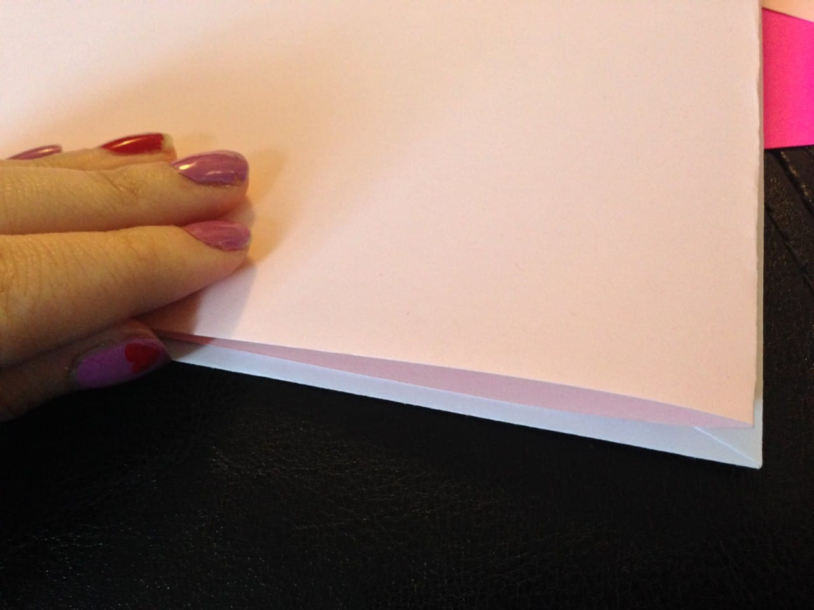
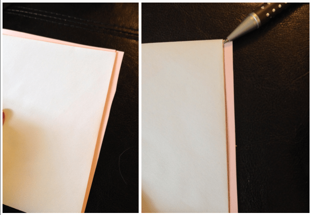
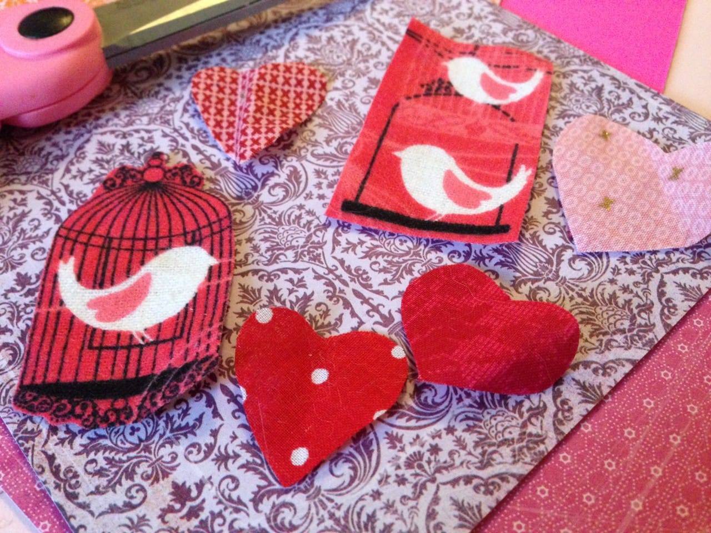
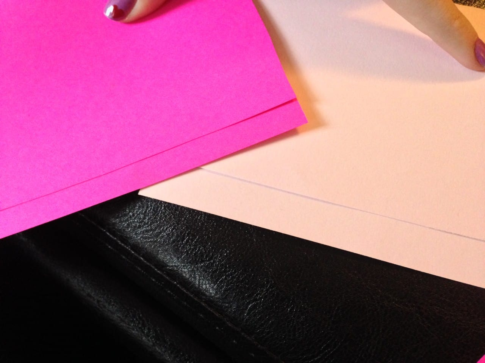
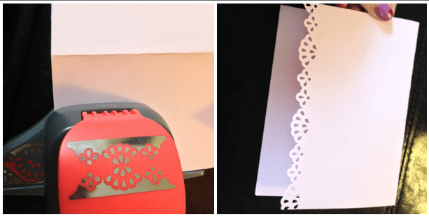
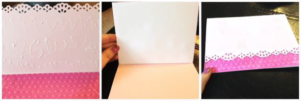
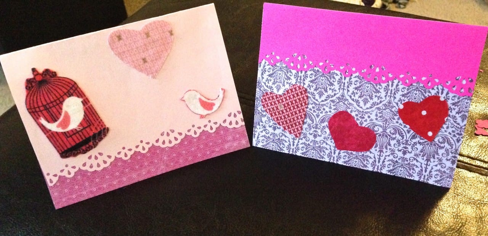

Project: Valentine’s Cards
<strong> </strong>
I received some fun
<a title="Doily Border Punches" href="http://amzn.to/1dtwHsS" target="_blank" rel="noopener noreferrer">doily border punches</a>
from my mother-in-law this past Christmas to add to my always growing scrapbooking collection. I’ve been excited to use them and figured some DIY Valentine’s cards would be the perfect way to break them in!

It’s pretty easy to pull together the supplies needed to make these cards. If you don’t have fancy hole punches, you can just use scissors and pretty paper to make yours. It’s all about creativity, so use your imagination!

It’s also the
<strong>
PERFECT
</strong>
time to dig through your
<strong>
scrap basket!
</strong>
What’s a scrap basket you ask? Well, I’ll tell you. At the end of each project, I end up with a
<strong>
LOT
</strong>
of stray pieces of fabric. I dare not throw them away- not when I can store them all in my scrap basket for a rainy day. Cutting out little hearts and such for card embellishments is just what these scraps are meant for!

Materials:
<ul><li>
Cardstock
</li><li>
Scrapbook papers in various colors and designs
</li><li>
Scraps from your fabric scrap basket
</li><li>
Scissors
</li><li>
Fun border or hole punches
</li><li>
Glue
</li><li>
Pen or pencil
</li><li>
Envelopes if you are mailing them
</li></ul>
Instructions:

Pick out some pretty patterned paper and whatever fabric scraps you think you’ll want to use for this project. You can always go digging again later if you are inspired and want to add more! I really love to buy booklets of various patterned papers for my scrapbooking kits, like the
<a title="Indie Bloom Paper" href="http://amzn.to/1ixGJ0W" target="_blank" rel="noopener noreferrer"><strong>
Indie Bloom
</strong></a>
one above. Lots of options and all are pretty!

If you aren’t mailing your cards and just giving them out by hand, you can skip this part. If you are using the good old postal service to deliver a valentine to your Valentine, you will need to cut down the piece of cardstock to fit the envelope. To do so, simply place the cardstock in the fold of the envelope and plan on cutting off a quarter of an inch from each side to make it fit in the envelope easily.

Now you can fold the cardstock in half and trim off the excess. Use a straight edge to trace a straight line and cut along it for a nice even card.

It’s time to cut out your fabric shapes! Make hearts, follow an already existing pattern (like the little birdcages below) or come up with another fantastic idea! Have fun!

Now that you have your fabric cut outs in the sizes you like, you can decide how to decorate your card. I cut off a portion of one side of each of my cards, so that when I used the border punch it would create a doily look over my pretty scrapbook paper. See below for photo examples!

Pick out whichever paper you like as your accent for under the doily cut out, and measure, trace and cut to make it card shaped/sized!
<figure id="attachment_227" aria-describedby="caption-attachment-227" class="post__figure"><figcaption id="caption-attachment-227">
Front side/Back side
</figcaption></figure>
Using a bit of glue (not too much or it will make the paper soggy!), glue the
<strong>
inside top
</strong>
of the card to the
<strong>
pretty side
</strong>
of the paper. Let your first card dry while you make a second! When everything is dry, glue your fabric embellishments to the cards for decoration.

Let dry and write your love poems in them! So cute! Since my mother-in-law gave me the edge punchers, I’m sending one of these to her. The other is for my Grams- she loves little birds!

What kind of Valentines are you making this year? What ideas do you have for scrap fabric projects? I’ll be featuring a new one each month and would love some suggestions!

