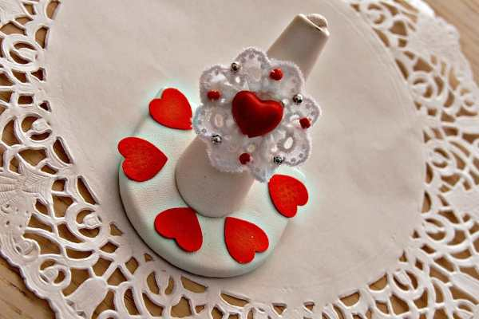
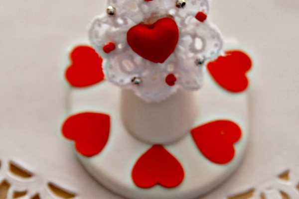
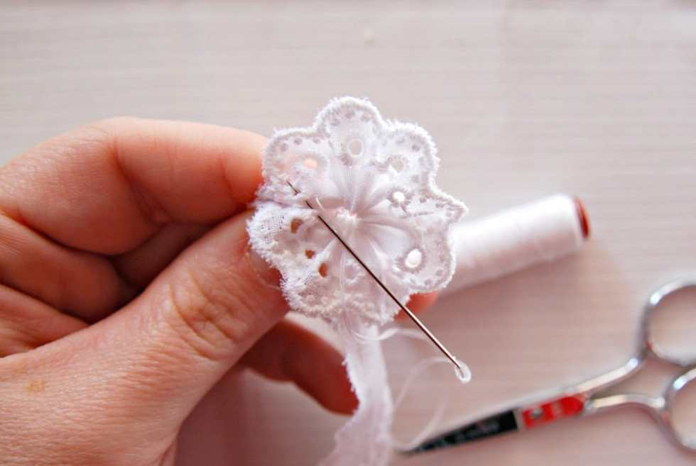
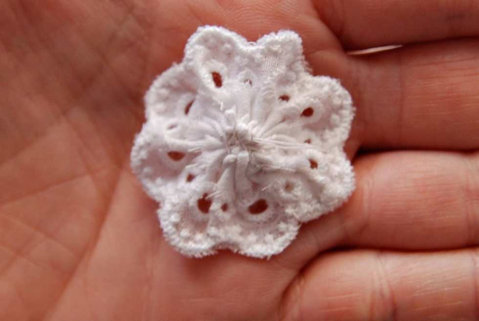
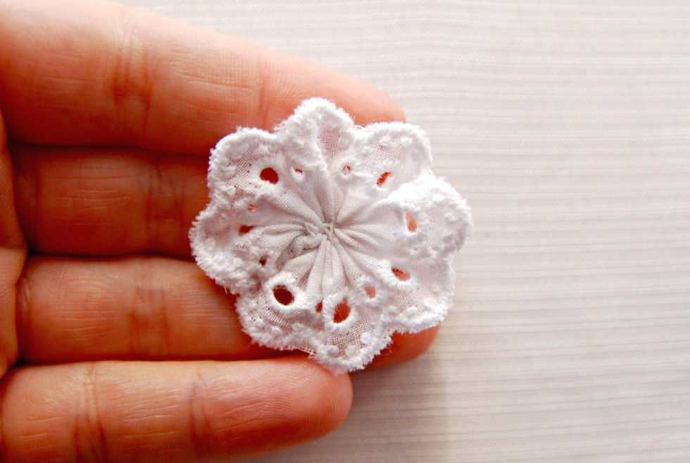
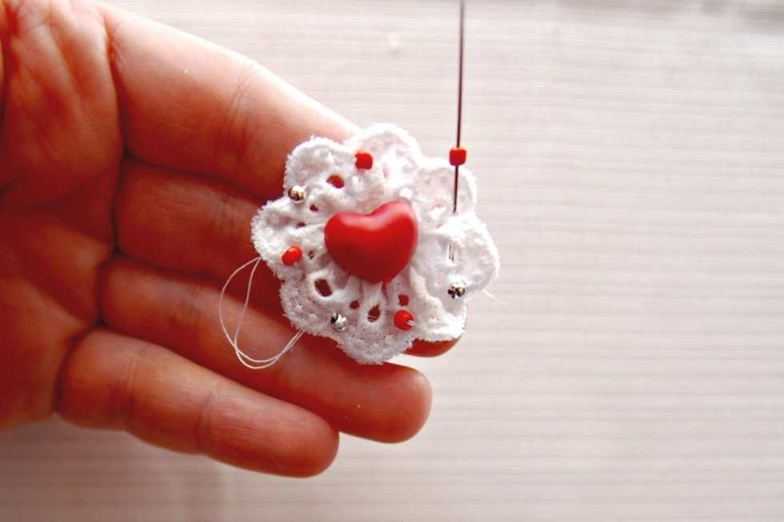
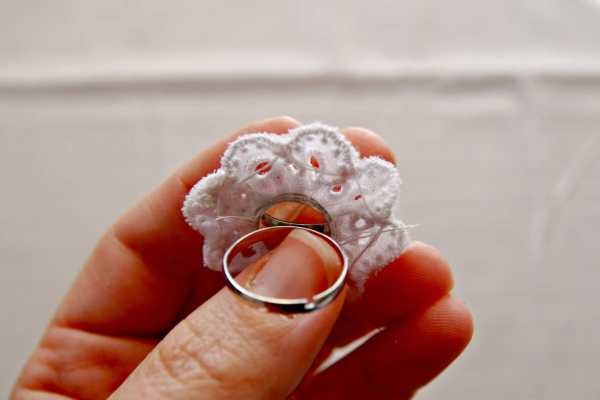
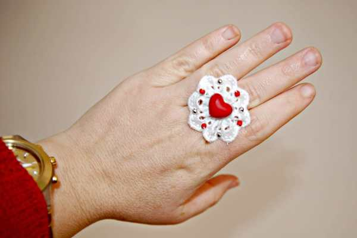
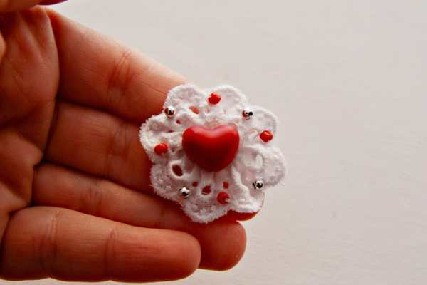
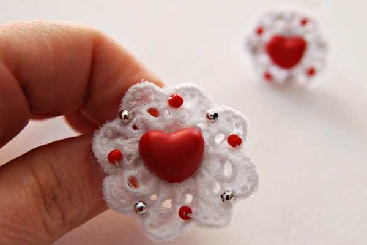

Happy Tuesday, readers! Today we will continue the Valentine’s theme with a fabulous tutorial by Lia from
<strong><a href="https://www.etsy.com/shop/MeandMamaCreations" target="_blank" rel="noopener noreferrer">Me and Mama Creations</a></strong>
! She made this super adorable Valentine’s Day rosette ring and was gracious enough to share her craft with us. After you learn how to make this ring, you can grab a coupon to her Etsy shop!

          
        

          
        

<h2>Materials:</h2><ul><li>
white lace or ribbon
</li><li>
heart shaped bead
</li><li>
seed beads in red and silver
</li><li>
adjustable ring base
</li><li>
hot glue gun
</li><li>
white thread
</li><li>
scissors
</li><li>
a needle and a few pins
</li></ul><h2>Instructions:</h2>
First, cut off about 12cm (4.70in) of the lace. I used a doily like lace, but you can use any kind of lace or ribbon you like, as long as it matches the color of the bead that you are going to use as a centerpiece.

The width of the lace should be around 1-1.5cm (0.40 – 0.60in), so as the rosette that you make will be 3 – 3.5cm (1.20 -1.40in) in diametre, which in my opinion is good for a ring.
 
However, if you like bigger rings a wider lace is more suitable for you. But, in that case you should buy more length.

If the top of your lace is not cut straight (like mine), then you need to turn the lace, as if you are about to make a hem and place a few pins all the way through the lace.

Now, you are ready to do the running stitch all through the length of the lace.

          
        

          
        

Every now and then, shirr the lace so that you make it ruffle, and form the rosette little by little.

You will also need to test and see if you can form a rosette as you might not need all the 12cm (4.70in) of lace. So when your rosette is ready sew the ends with backstitch (above), cut off excess lace, and run a few stitches back and forth the centre of the rosette to make it firm and stable.

DO NOT CUT OFF the thread yet! You will need it in a while to sew the seed beads.
 
Your rosette ring is now ready.

Glue the heart at the centre of the rosette.

Make sure that you glue it at the right side of the rosette.
 
Take the seed beads and sew them on the edges of the rosette with a running stitch.

Finally, hot glue the rosette on the ring base, carefully, making sure that when you wear it the heart is straight.

          
        

          
        

Your Valentine’s Day ring is ready for you to wear!!!

          
        

          
        

Enjoy Valentine’s Day and have an absolutely fabulous Valentine’s night out!

          
        

          
        

<blockquote>
<em>**You can find more Valentine’s Day gift ideas from</em>
<em><strong><a href="https://www.etsy.com/shop/MeandMamaCreations?section_id=16542653&#x26;ref=shopsection_leftnav_6" target="_blank" rel="noopener noreferrer">Me and Mama Creations right here</a>
!
</strong>
For a limited time, ANY order from her shop gets a 10% discount using the coupon code
<strong>
DISC10
</strong>
. Offer expires at the end of January, so hurry! And don’t forget to check out
<strong><a href="https://www.facebook.com/meandmamacreations/" target="_blank" rel="noopener noreferrer">Lia’s Facebook page</a></strong>
and give her a like!
</em></blockquote>
