
Finally! I finally got together my favorite photos from my trip to Washington D.C. a couple weekends ago. The Husband and I had so much fun and took SO many photos of the many things we saw (Art! History! Cherry Blossoms!) that it took a long time to parse through the best. Check out all my favorites in my Washington D.C. trip photo recap below!

We spent three days on our vacation. The first day we walked ALL OVER, checking out all the monuments, Tidal Basin, cherry blossoms and more. Since there was a huge storm the week before we went, the pretty flowers on the cherry trees were few and far between. Still, we managed to find some!

Our first glimpse of the Washington Monument from our car.

Could the lobby of our hotel be any more gorgeous?

Farragut Square

          
        

          
        

          
        

          
        

<figure id="attachment_8140" aria-describedby="caption-attachment-8140" class="post__figure"><figcaption id="caption-attachment-8140">
There’s the White House, far away in the background!
</figcaption></figure>

<figure id="attachment_8155" aria-describedby="caption-attachment-8155" class="post__figure"><figcaption id="caption-attachment-8155">
It was SO COLD!
</figcaption></figure>

<figure id="attachment_8072" aria-describedby="caption-attachment-8072" class="post__figure"><figcaption id="caption-attachment-8072">
Take a moment to look at this creepy mermaid face man with lots of teeth.
</figcaption></figure><figure id="attachment_8073" aria-describedby="caption-attachment-8073" class="post__figure"><figcaption id="caption-attachment-8073">
SO CREEPY.
</figcaption></figure><figure id="attachment_8145" aria-describedby="caption-attachment-8145" class="post__figure"><figcaption id="caption-attachment-8145">
CHERRY BLOSSOMS! WE FOUND SOME!
</figcaption></figure>

          
        

          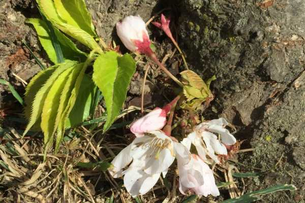
        

<figure id="attachment_8152" aria-describedby="caption-attachment-8152" class="post__figure"><figcaption id="caption-attachment-8152">
Washington Monument and the Jefferson Memorial in one shot from across the Tidal Basin.
</figcaption></figure>

          
        

          
        

          
        

<figure id="attachment_8149" aria-describedby="caption-attachment-8149" class="post__figure"><figcaption id="caption-attachment-8149">
Hollowed out tree is still going strong with green leaves growing atop!
</figcaption></figure>

          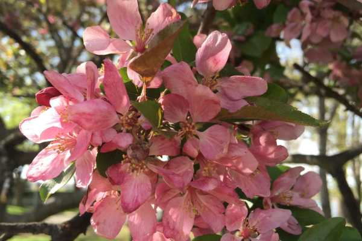
        

          
        

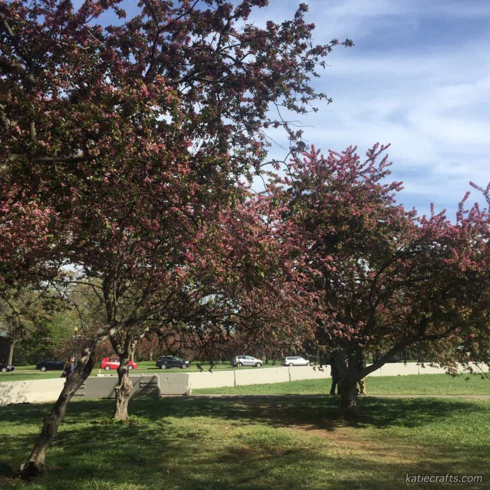

          
        

          
        

          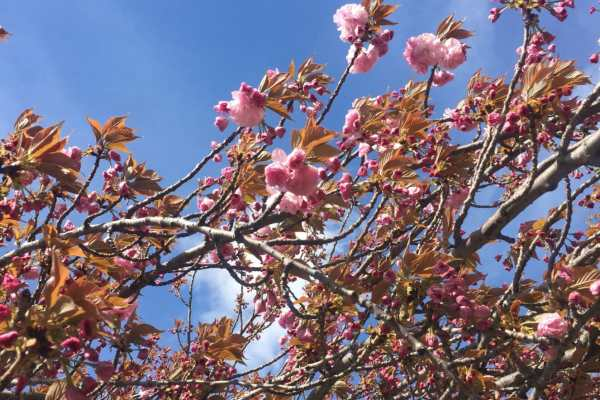
        

          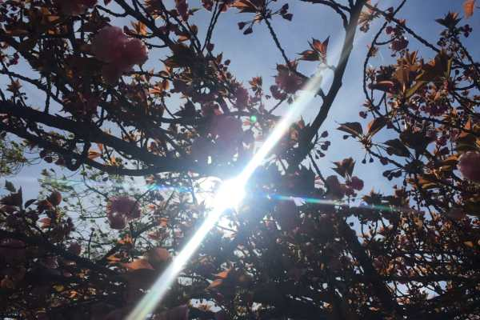
        

          
        

          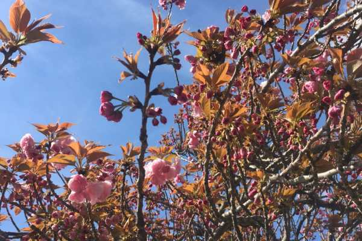
        

Day two we spent in an art whirlwind! We went to the
<a href="http://www.nga.gov/content/ngaweb.html" target="_blank" rel="noopener noreferrer"><strong>
National Gallery of Art
</strong></a>
and then the
<a href="https://www.si.edu/" target="_blank" rel="noopener noreferrer"><strong>
Smithsonian’s American Art Museum &#x26; Portrait Gallery
</strong></a>
. It was a freezing and windy day that day (it even snowed in the morning, despite it being April!), so I was quite happy to spend the day warm amongst the talented masters.

          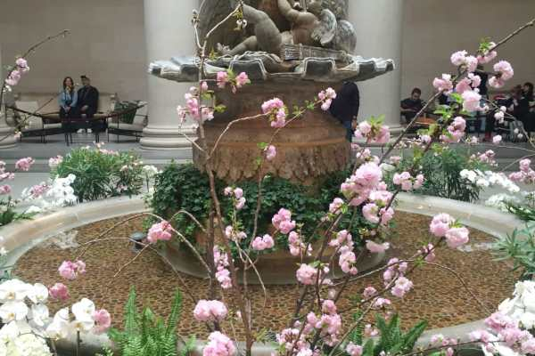
        

          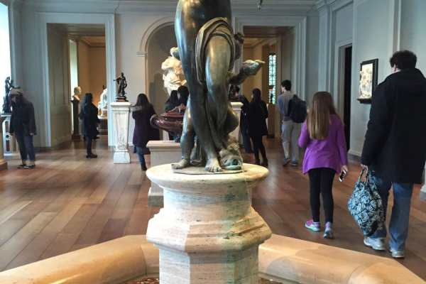
        

<figure id="attachment_8079" aria-describedby="caption-attachment-8079" class="post__figure">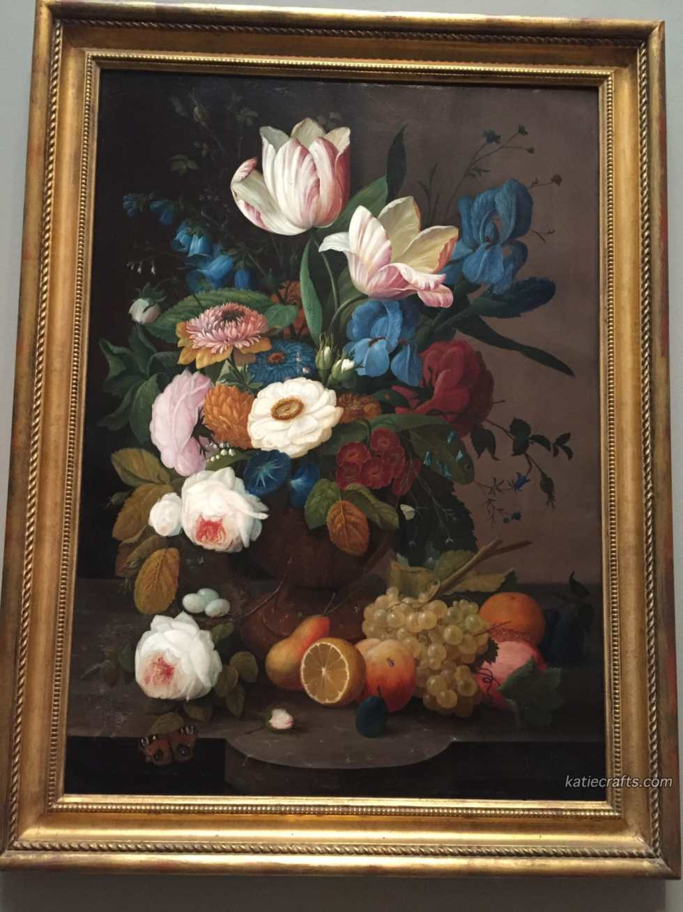<figcaption id="caption-attachment-8079">
“Still Life, Flowers and Fruit” by Severin Roesen, 1848
</figcaption></figure><figure id="attachment_8078" aria-describedby="caption-attachment-8078" class="post__figure"><figcaption id="caption-attachment-8078">
“Ripening Pears” by Joseph Decker, 1884-1885
</figcaption></figure><figure id="attachment_8082" aria-describedby="caption-attachment-8082" class="post__figure"><figcaption id="caption-attachment-8082">
“Giant Magnolias on a Blue Velvet Cloth” by Martin Johnson Heade, 1890
</figcaption></figure><figure id="attachment_8086" aria-describedby="caption-attachment-8086" class="post__figure"><figcaption id="caption-attachment-8086">
“Roses” by Vincent Van Gogh, 1890
</figcaption></figure><figure id="attachment_8084" aria-describedby="caption-attachment-8084" class="post__figure"><figcaption id="caption-attachment-8084">
“Poor Artist’s Cupboard” by Charles Bird King, 1815.
 
This one was on a special exhibition at the Philadelphia Art Museum last year, but as it was a special exhibit, I couldn’t take photos! Was glad to see it again in it’s natural habitat so that I could snap this one.
</figcaption></figure><figure id="attachment_8088" aria-describedby="caption-attachment-8088" class="post__figure">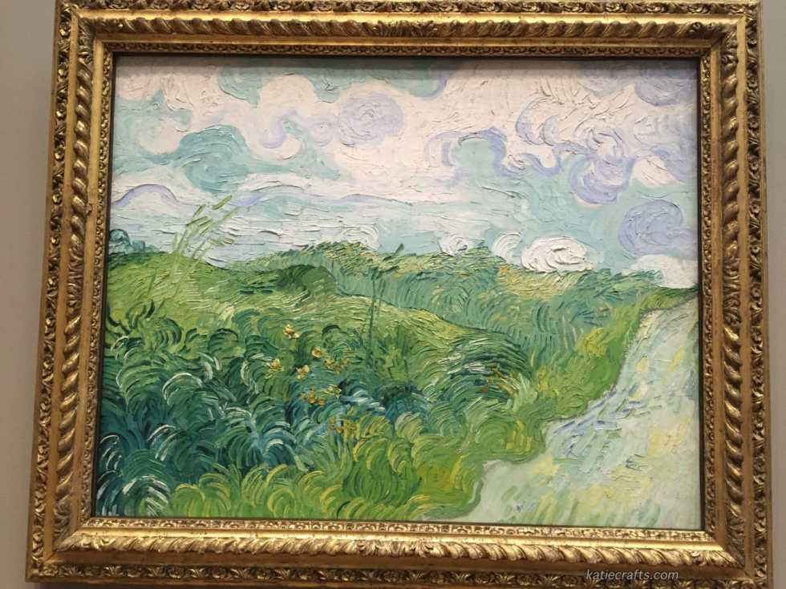<figcaption id="caption-attachment-8088">
“Green Wheat Fields, Auvers” by Vincent Van Gogh, 1890
</figcaption></figure><figure id="attachment_8090" aria-describedby="caption-attachment-8090" class="post__figure"><figcaption id="caption-attachment-8090">
“Four Dancers” by Edgar Degas, 1899
</figcaption></figure><figure id="attachment_8157" aria-describedby="caption-attachment-8157" class="post__figure"><figcaption id="caption-attachment-8157">
Van Gogh’s creepy green baby, titled “Roulin’s Baby” from 1888.
</figcaption></figure><figure id="attachment_8092" aria-describedby="caption-attachment-8092" class="post__figure"><figcaption id="caption-attachment-8092">
I wish I could capture the shimmer and shine of all the beads and sequins on this piece!
</figcaption></figure><figure id="attachment_8093" aria-describedby="caption-attachment-8093" class="post__figure"><figcaption id="caption-attachment-8093">
All of the US, in lights and TV screens.
</figcaption></figure>

<figure id="attachment_8095" aria-describedby="caption-attachment-8095" class="post__figure">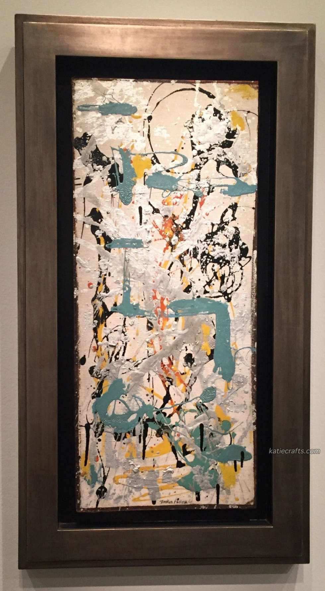<figcaption id="caption-attachment-8095">
Jackson Pollock! Love.
</figcaption></figure>
We went to the
<a href="https://www.usbg.gov/" target="_blank" rel="noopener noreferrer"><strong>
United States Botanic Garden
</strong></a>
and the
<a href="https://www.si.edu/" target="_blank" rel="noopener noreferrer"><strong>
Smithsonian Air &#x26; Space Museum
</strong></a>
on our last day in D.C.

          
        

          
        

          
        

          
        

          
        

          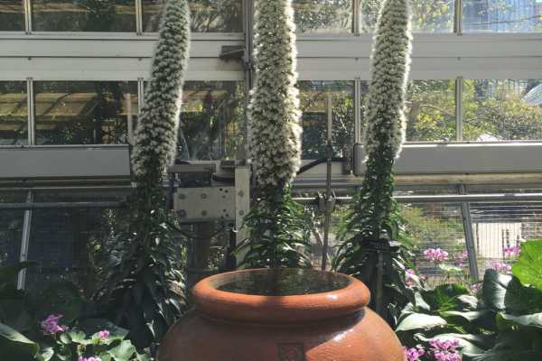
        

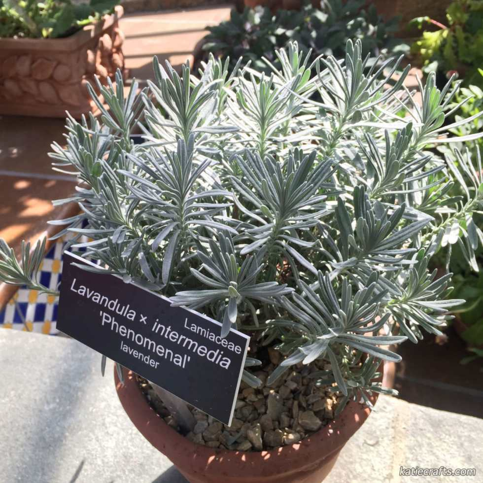

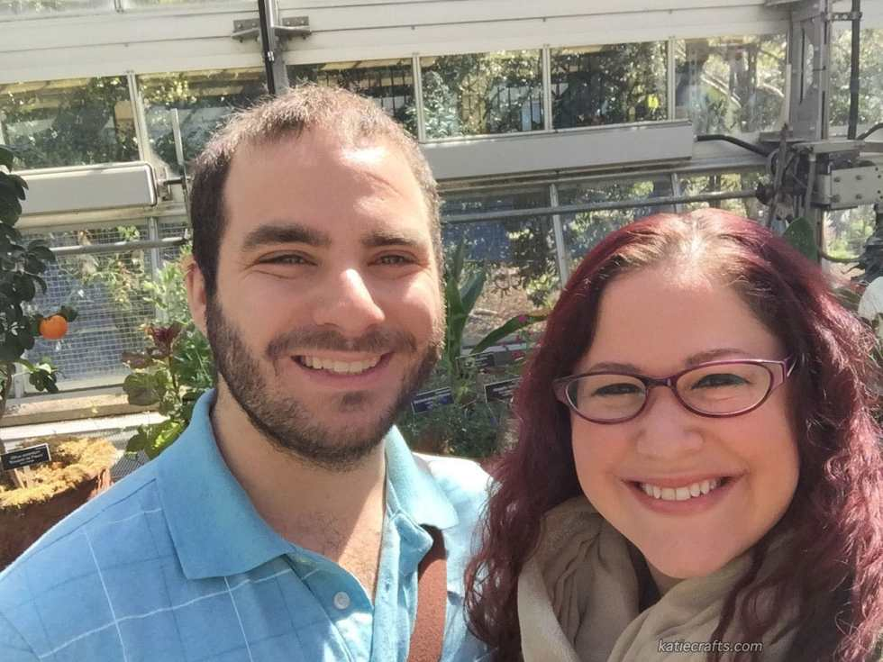

          
        

          
        

          
        

          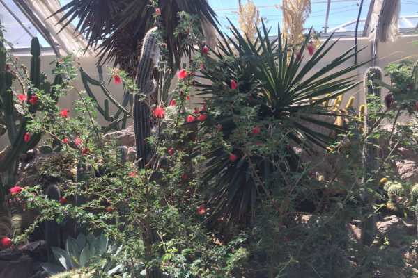
        

          
        

          
        

          
        

          
        

There was a really pretty orchid display exhibit going on while we were there!

          
        

          
        

          
        

          
        

<figure id="attachment_8124" aria-describedby="caption-attachment-8124" class="post__figure"><figcaption id="caption-attachment-8124">
Maxin &#x26; Relaxin for this little orchid.
</figcaption></figure>

<figure id="attachment_8159" aria-describedby="caption-attachment-8159" class="post__figure">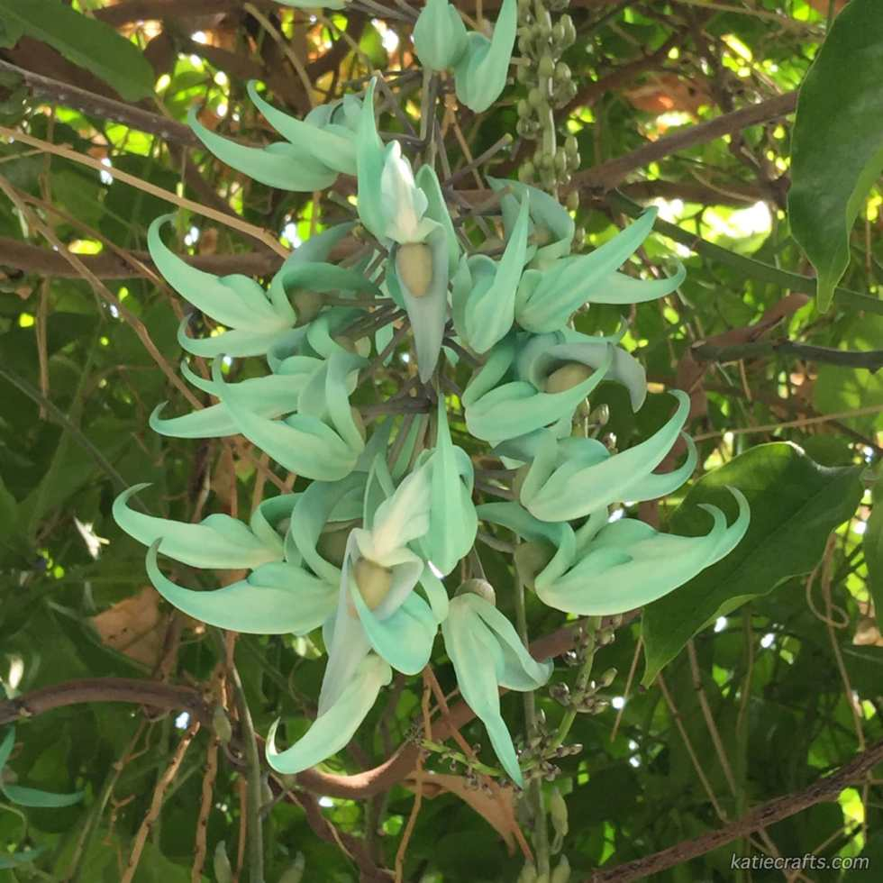<figcaption id="caption-attachment-8159">
How cool are these “Emerald Creepers”?! The color was amazing.
</figcaption></figure>

          
        

          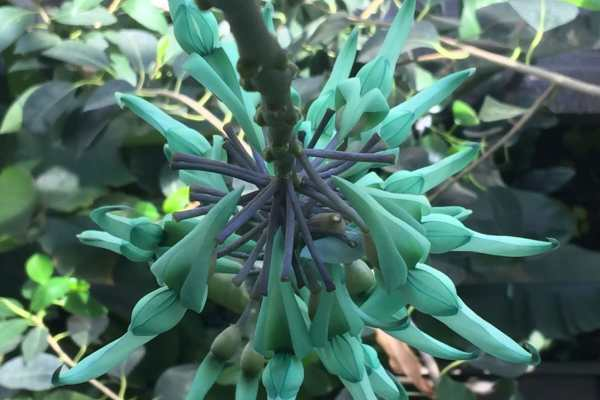
        

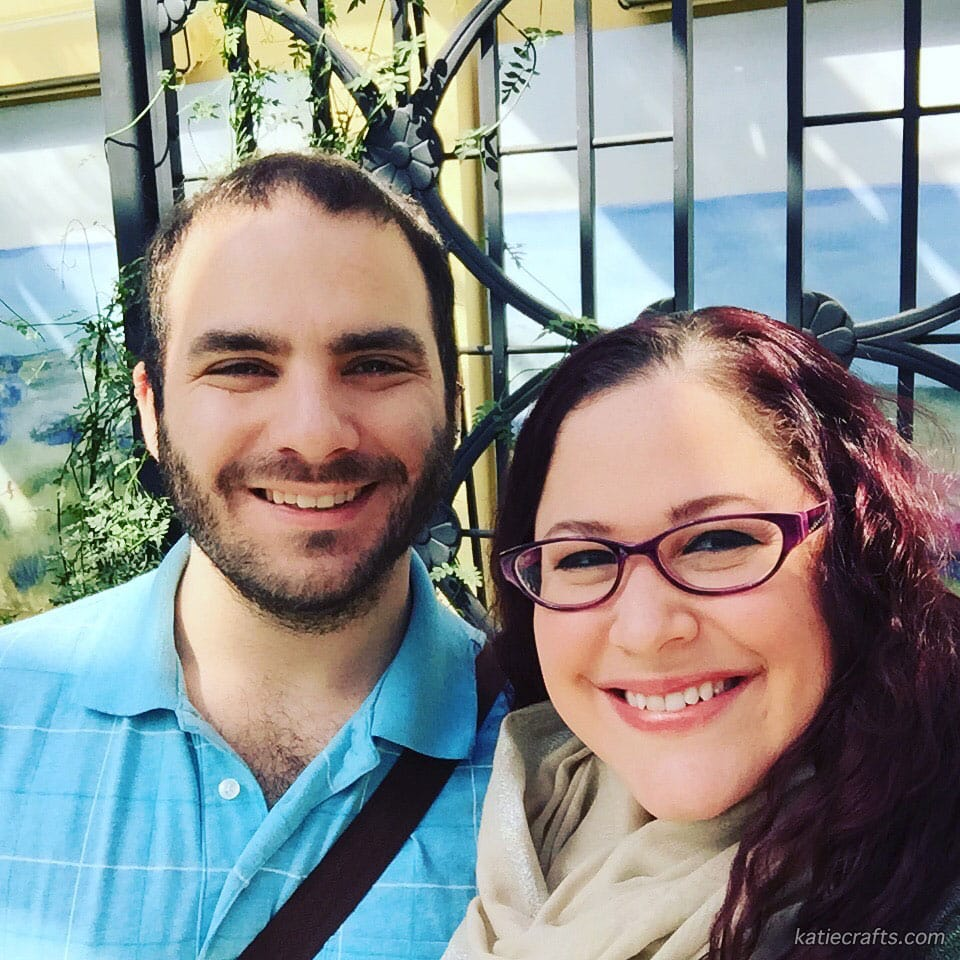
<figure id="attachment_8137" aria-describedby="caption-attachment-8137" class="post__figure"><figcaption id="caption-attachment-8137">
Even the back of the Botanic Gardens were lovely!
</figcaption></figure>

          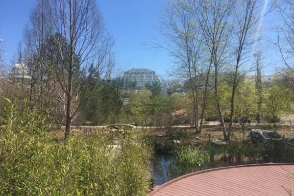
        

          
        

<figure id="attachment_8134" aria-describedby="caption-attachment-8134" class="post__figure"><figcaption id="caption-attachment-8134">
Hungry duckies!
</figcaption></figure>

          
        

          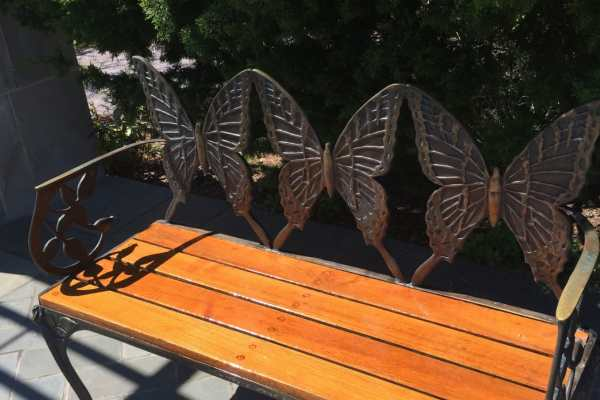
        

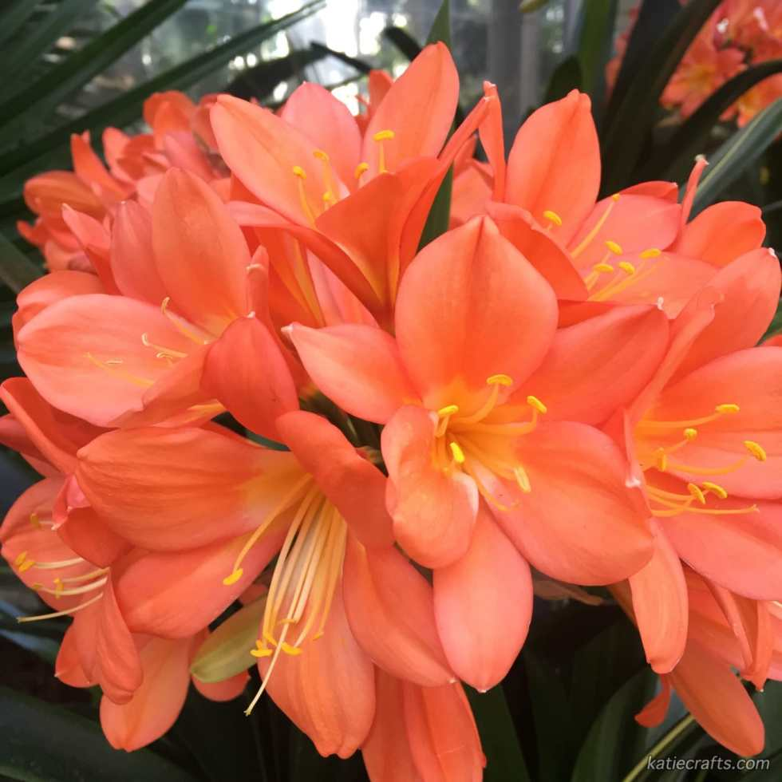

It was a jam-packed mini vacation, but we had a great time! We’ll definitely go back when it’s a little less cold out. 😉

Have you ever been to Washington D.C. before? What was your favorite thing to do there?

