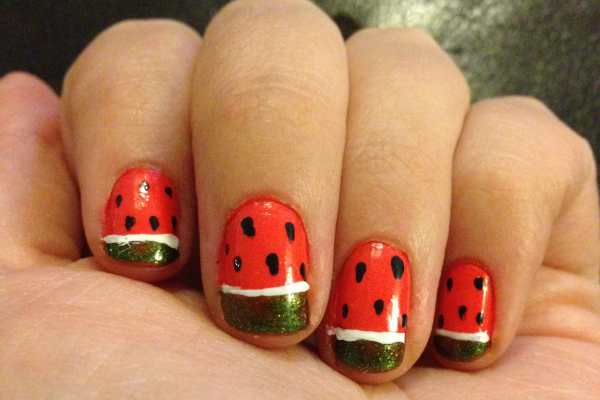

<strong> </strong>
Inspired yesterday by
<em><a title="The Art and Tree Chatter of Aquariann" href="http://blog.aquariann.com/2014/08/french-tip-manicure-watermelon-nail-art.html" target="_blank" rel="noopener noreferrer">Aquariann</a>
‘s
</em>
watermelon nail wrap post, I decided to try my hand at making my own watermelon nail art design! My
<em><a title="Apples Nail Art Design" href="/apples-nail-art-design/">apple design</a></em>
is still my fave fruit so far, but these are a pretty cute way to end the summer. BONUS: If you skip one step, you end up with
<em>
strawberry nails
</em>
! Which do you like better?
<h2>Materials:</h2><ul><li>
Pink or red nail polish
</li><li>
Green nail polish
</li><li>
Black nail polish
</li><li>
White striper or white nail polish + nail art brush
</li><li>
Dotting tool or toothpick
</li><li>
Clear top coat
</li></ul><h2>Instructions:</h2><ul><li>
With clean dry nails, do one coat of your pink or red nail polish and let dry. I used my favorite coral shade (
<a title="Essie " come="" here!&#x26;#x26;#x26;#x26;#x26;#x22;="" polish&#x26;#x26;#x26;#x26;#x26;#x22;="" href="http://amzn.to/1n5xxBU" target="_blank" rel="noopener noreferrer">Essie’s “Come Here”</a>
) since soon I will have to retire it for the season! You don’t have to use coral, if you don’t want to, though! You can use red if you are going for a strawberry look, or hot pink for a great watermelon design!
</li></ul>
One streaky coat! (Please ignore how horribly cracked and dry my hands look! No matter now much lotion I put on them before I take photos for the blog, they always look like they belong to someone 108 years old.)
<ul><li>
See those streak marks from one coat? Do a second coat and let dry completely.
</li></ul><figure id="attachment_4075" aria-describedby="caption-attachment-4075" class="post__figure"><figcaption id="caption-attachment-4075">
Two coats- much better!
</figcaption></figure><ul><li>
With your green polish (I used Confetti’s “My Favorite Martian”), do a somewhat thick french tip on the top quarter to third of your nail. This is the top of your watermelon slice! Let dry.
</li></ul><figure id="attachment_4076" aria-describedby="caption-attachment-4076" class="post__figure"><figcaption id="caption-attachment-4076">
One coat of green
</figcaption></figure><ul><li>
If the polish you choose is streaky here too, do a second green tip coat and let dry.
</li></ul><figure id="attachment_4077" aria-describedby="caption-attachment-4077" class="post__figure"><figcaption id="caption-attachment-4077">
Two coats of green
</figcaption></figure><ul><li>
Use your dotting tool or toothpick and some black nail polish, and make little seeds throughout the pink/red. Let dry.
</li></ul><figure id="attachment_4078" aria-describedby="caption-attachment-4078" class="post__figure"><figcaption id="caption-attachment-4078">
Seeds!
</figcaption></figure><ul><li>
Right now, you can call it a day, do a quick coat of clear polish, and end the design with some strawberry nails if you want!
</li></ul><figure id="attachment_4079" aria-describedby="caption-attachment-4079" class="post__figure"><figcaption id="caption-attachment-4079">
Don’t worry about nails not being cleaned up- you can do this at the end!
</figcaption></figure><ul><li>
If you want to continue to have watermelon nails, use your white striper or white nail polish and a nail art brush to make a thin line between where the pink and green meet.
</li></ul><figure id="attachment_4081" aria-describedby="caption-attachment-4081" class="post__figure"><figcaption id="caption-attachment-4081">
Watermelons!
</figcaption></figure><ul><li>
Finish with clear top coat. Done!
</li></ul>

          
        

          
        

So which do you like better: straawwwwberries or watermelons?

