
Last week’s
<a title="4th of July Mason Jar Candles" href="/4th-of-july-mason-jar-candles/">4th of July Mason Jar DIY</a>
made me think back to my wedding! I used Mason jars in a few different ways, and had even more ways that I had wanted to use them (but simply ran out of time to do so!) Since we are smack in the middle of Wedding Season right now, I thought there would be no better time to share some great do-it-yourself ideas on how to use Mason jars at your own rustic shabby chic wedding!

If you are looking for some wedding décor that is less DIY but still super personalized, you have lots of options to help you plan your wedding. Put your engagement photos to good use by featuring them on some of your wedding decorations! Sites like
<a href="http://www.shutterfly.com" target="_blank" rel="noopener noreferrer">Shutterfly</a>
have got you covered for
<a href="http://www.shutterfly.com/home-decor-new?esch=1&#x26;s_tnt=165904:8:0" target="_blank" rel="noopener noreferrer">tabletop decoration ideas</a>
that you and your fiancé will love! (They’ve even got some pretty amazing
<a href="http://www.shutterfly.com/weddings/" target="_blank" rel="noopener noreferrer">gift ideas</a>
!) No matter what you end up choosing, as long as you love it, everyone else will too!

All of my ideas down below would make a fabulous wedding favor, as well as a really cute centerpiece or decoration on the tables! I love when things have a dual purpose, don’t you? I used 4-ounce quilted Jelly jars for these projects, but other sizes would work too! Just adjust your materials to fit. Here are each of the three ideas, complete with photos, tutorials and even a recipe thrown in the mix! Enjoy!
<h2>Floating Candle Votive</h2>
These romantic vintage-style Mason jars will definitely set the mood for a wonderful evening! Swap out whatever colors will match your own big day, and get creative with the ribbons/lace/twine!

Materials for one:
<ul><li>
4 oz Mason jar
</li><li>
Small tea light
</li><li>
Two different sized/colored ribbons (in your color or theme)*
</li><li>
Twine
</li><li>
Glue (Elmer’s, or something similar)
</li><li>
Scissors
</li><li>
Water
</li></ul>
*I used a sheer cream ribbon and a satin sage green ribbon.

Instructions:
<ul><li>
First up, you’ll want to ditch the lid. You won’t need it at all for this project!
</li><li>
Next, put a small dot of glue on your jar where the first ribbon will go.
</li><li>
Place the ribbon on the glue dot and let it dry.
</li></ul>

          
        

          
        

<ul><li>
Wrap the ribbon tightly around the jar, add another glue dot to hold it down, and snip the excess ribbon. Let dry.
</li></ul>

          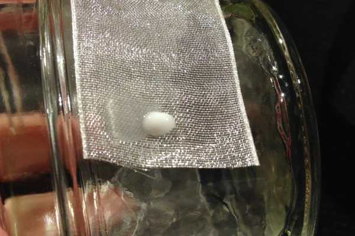
        

          
        

<ul><li>
Glue, let dry, wrap and glue the second piece of ribbon on top of the first. Center it if you like, as I did! Let dry.
</li><li>
Tie a piece of twine around the center of it all.
</li></ul>
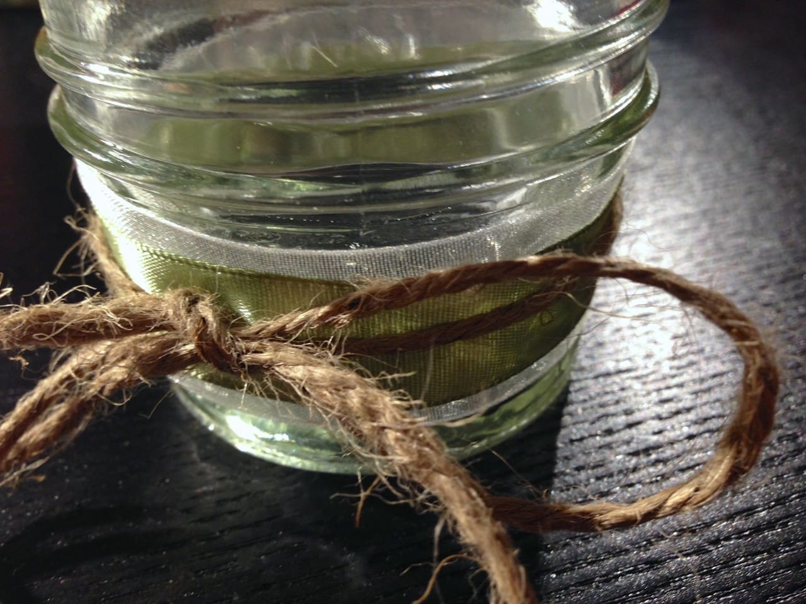
<ul><li>
Fill 3/4 of the way with water.
</li><li>
Add tea light to water, and light! Watch it float dreamily in the votive!
</li></ul>

<h2>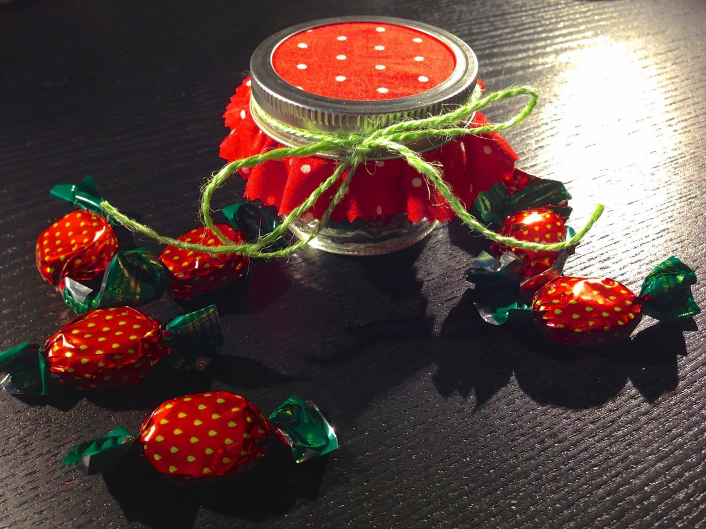</h2><h2>Candy Jar Favors</h2>
The 4-ounce Mason jars are also known as Jelly jars, since that is what they were made for! Homemade jelly or jam is definitely an option (a delicious, delicious option) but may be a bit of work for the busy bride-to-be. This DIY is much quicker, mega cheap, and crazy cute! Stack them adorably on their own table by the escort cards, or use them as an element of decoration on the dinner tables! Use whatever candy and fabric match your theme: I chose strawberries for a fun summer wedding!

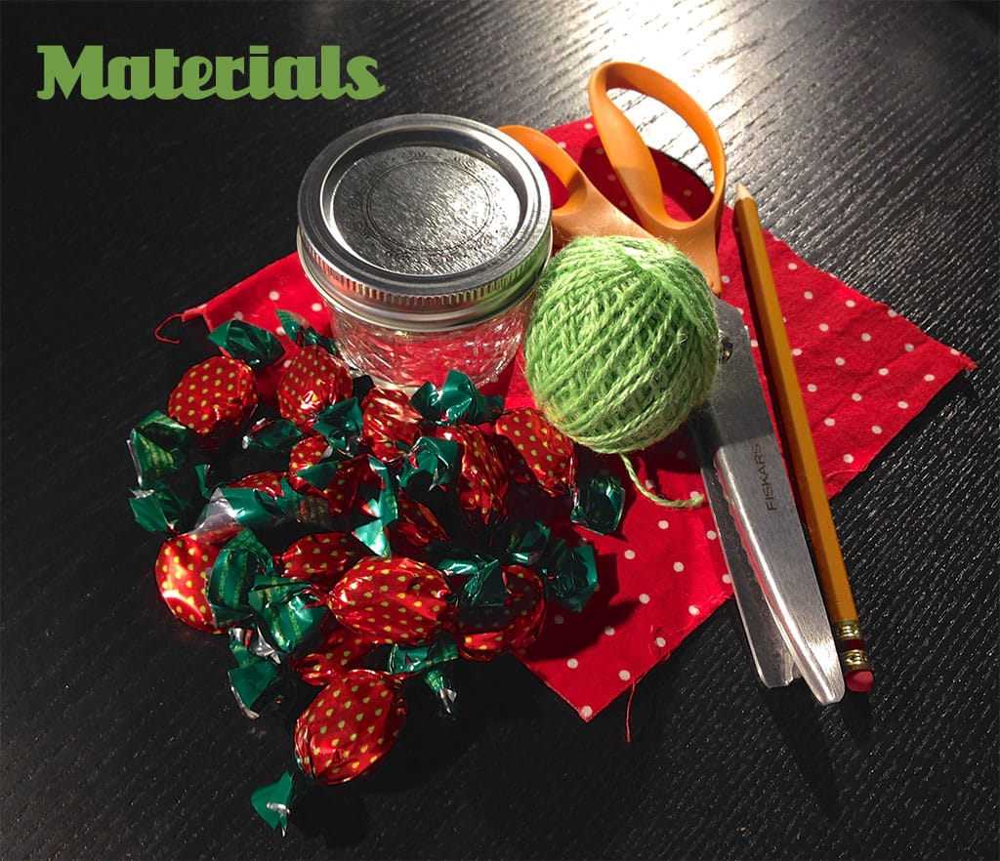

Materials for one:
<ul><li>
4 oz Mason jar
</li><li>
Candies (in your color or theme)
</li><li>
Square of fabric (in your color or theme)
</li><li>
Twine or ribbon (in your color or theme)
</li><li>
Pinking shears
</li><li>
Pencil
</li></ul>
Instructions:
<ul><li>
Remove the lid from your Mason jar and discard the inner piece as you won’t be needing it.
</li><li>
Turn the fabric over so the patterned side is face down on your table.
</li><li>
Using your lid as a guide, sketch a circle around the lid about an inch and a half from the lid. (It’s hard to see, but the pencil is pointing towards it!)
</li></ul>

<ul><li>
Now fold your fabric in half, and in half again, as shown.
</li><li>
Follow your penciled sketch and cut the fabric with your pinking shears.
</li></ul>

          
        

          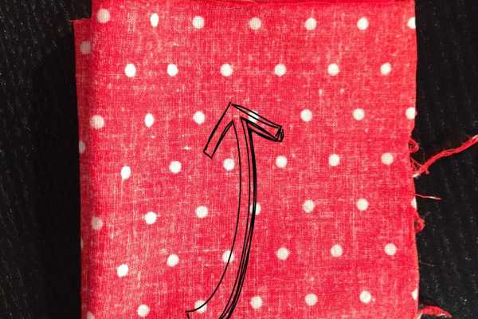
        

          
        

          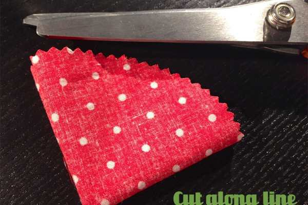
        

<ul><li>
Unfold completely and you’ll have a circle!
</li></ul><figure id="attachment_3530" aria-describedby="caption-attachment-3530" class="post__figure"><figcaption id="caption-attachment-3530">
Look! A circle!
</figcaption></figure><ul><li>
Fill your jar with your candies.
</li></ul>
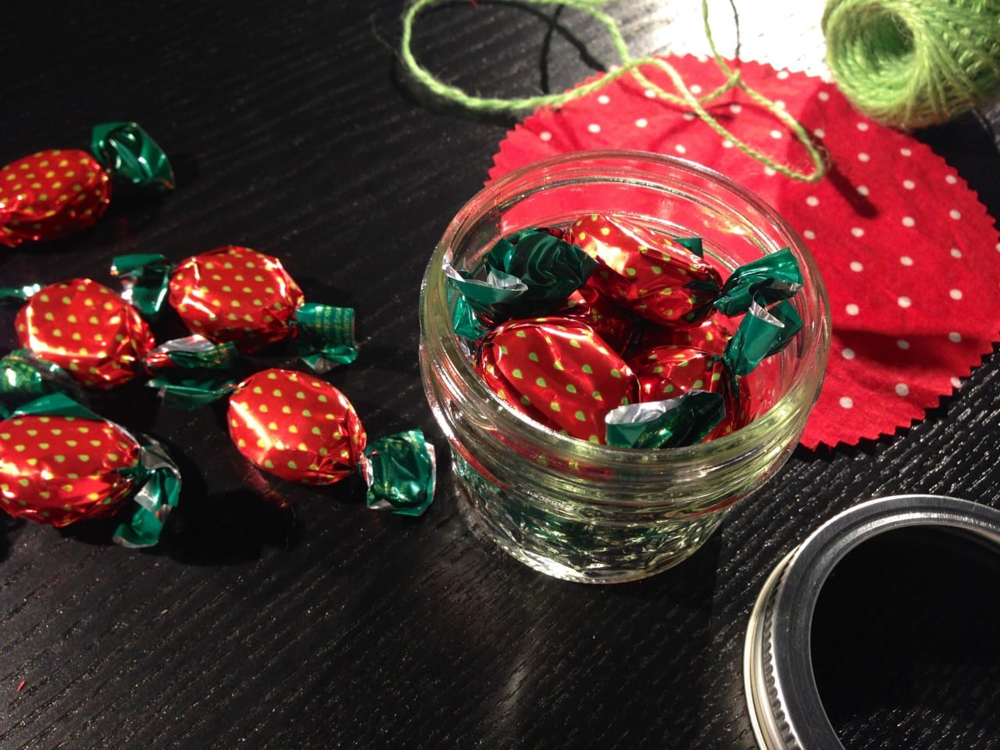
<ul><li>
Place the fabric circle centered over the top of the jar, and screw the outside portion of the lid right on top of the fabric.
</li></ul>

          
        

          
        

<ul><li>
You may pull the fabric down to make it more taut after it’s been screwed on.
</li><li>
Place a piece of twine or ribbon around the metal lid to jazz it up!
</li></ul>
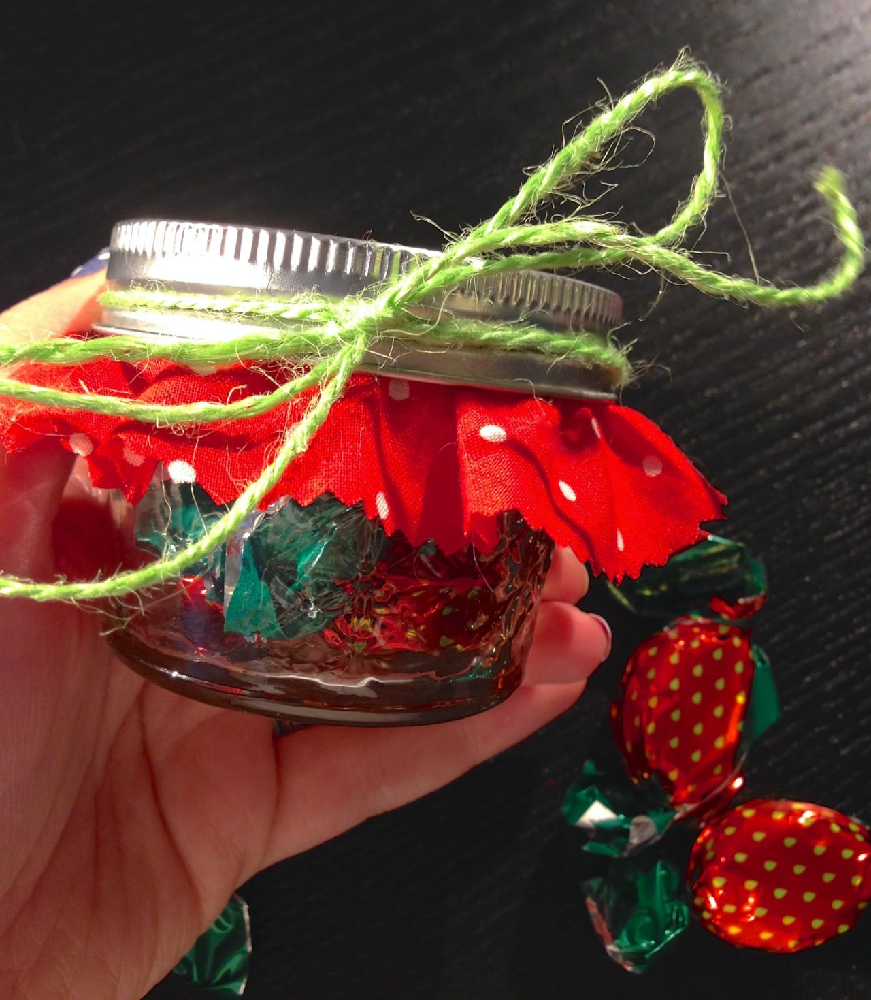

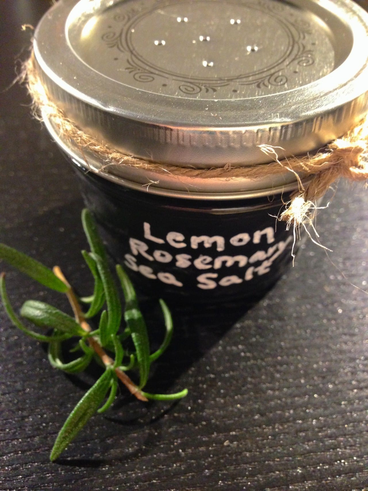
<h2>Distressed Chalkboard Shaker with Lemon Rosemary Sea Salt</h2>
This is another great favor that doubles as cute table décor for a rustic shabby chic wedding! You can swap out the chalkboard paint for any acrylic paint in your color/theme. Just use a paint marker instead of a chalk marker to label your jar. When stored in an airtight container, the lemon rosemary sea salt can last up to two months! That means you can make a giant batch a month before your wedding, and simply fill all your pre-made distressed jars at the last minute so your guests may enjoy it for an additional few weeks post-wedding. First, I’ll share how to make the super fun vintage-y jars, and then we’ll go onto the sea salt recipe!

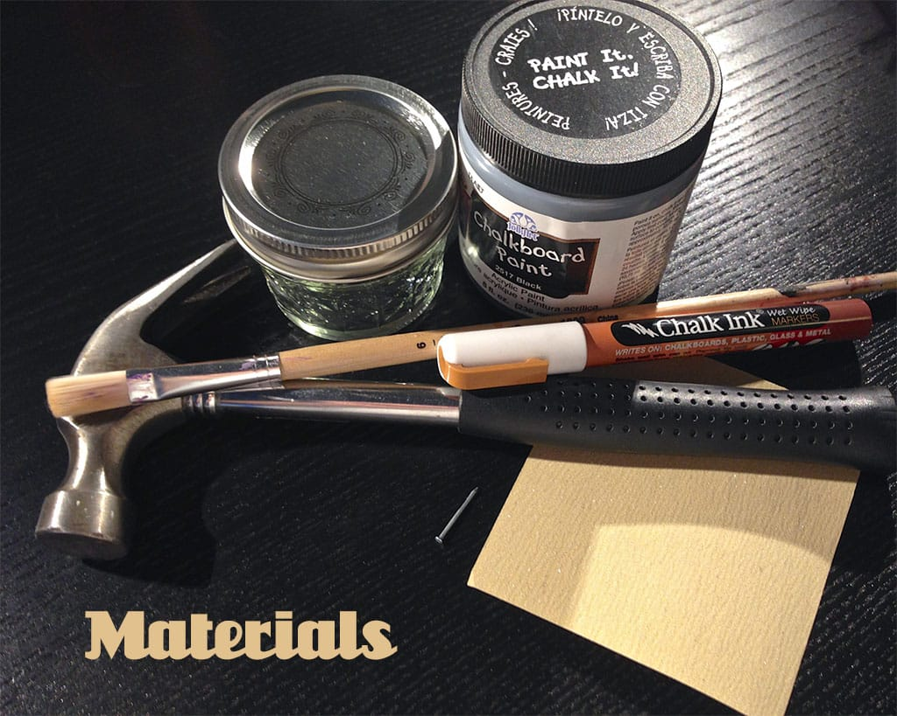

Materials for one:
<ul><li>
4 oz Mason jar
</li><li>
Chalkboard paint
</li><li>
Chalk marker
</li><li>
Hammer
</li><li>
Small nail
</li><li>
Sandpaper, extra fine grit
</li><li>
Paint brush
</li><li>
Twine (optional for decoration)
</li><li>
Sea salt (recipe below)
</li></ul>
Instructions:

<ul><li>
With lid firmly on jar, gently make 6 dents (one in center with five in circle around it) using the nail and hammer.
</li><li>
If you are satisfied with the placement of the dents, go ahead and carefully use the nail and hammer to make holes where you’ve dented the metal lid.
</li></ul>

          
        

          
        

<ul><li>
Use a corner of your sand paper to gently remove any loose tiny shards of metal that may be on the back of the lid.
</li></ul>
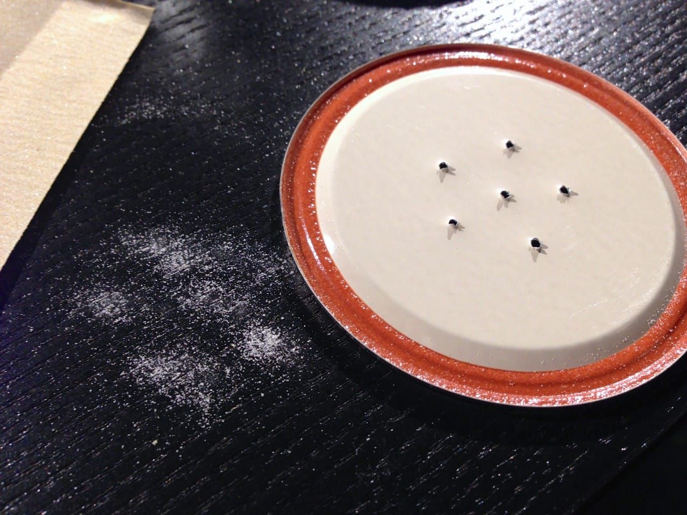
<ul><li>
Wash your lid (very carefully!) and jar thoroughly and dry completely.
</li></ul>

<ul><li>
Do one coat of paint on the outside of your jar. It will be streaky- that’s okay! If you are using acrylic, it will be dry quite quickly. If you are using the chalkboard paint, follow the instructions on it for how long to let it dry. Placing it in front of a fan will help “cure” it much quicker, as it takes awhile for the chalkboard paint.
</li></ul>

<ul><li>
Once dry (or at least mostly dry!), do a second coat of paint to cover up the streaks. Let dry completely.
</li></ul><figure id="attachment_3550" aria-describedby="caption-attachment-3550" class="post__figure">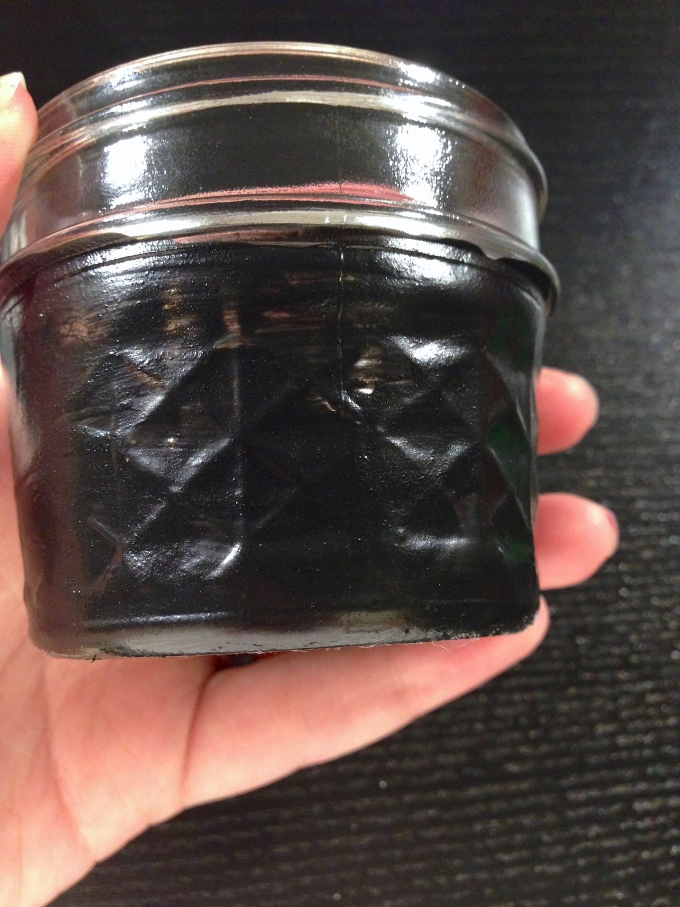<figcaption id="caption-attachment-3550">
What it looks like dry!
</figcaption></figure><ul><li>
When your jar is
<em>
totally dry,
</em>
use the sandpaper to go over the raised areas of glass. This will give it the distressed vintage look! If you are using a jar with raised text on it (such as Ball), then you can gently scrape away the paint from the word so it becomes visible. Because I used the quilted jars, I was able to distress many spots! Do this to your heart’s content- it is up to you how you want it to look.
</li></ul>

          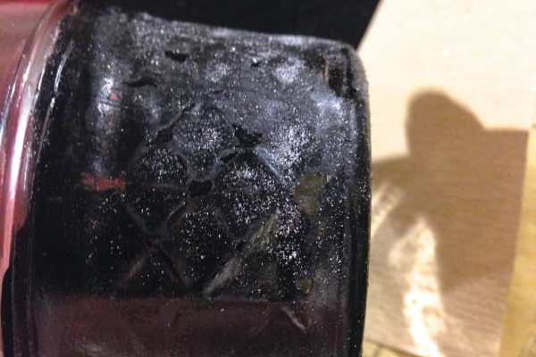
        

          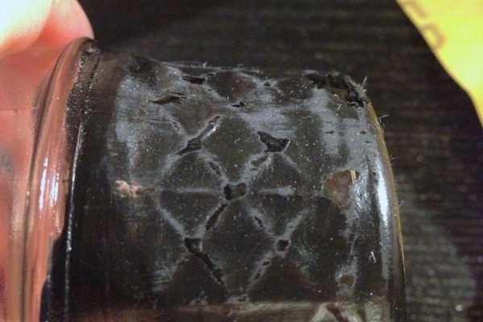
        

<ul><li>
Use a cloth or paper towel to wipe off any of the sand/paint bits when you are finished distressing.
</li></ul>

<ul><li>
Use chalk marker to write name of contents on front.
</li><li>
Fill with sea salt, close jar and tie twine around if you please!
</li></ul>
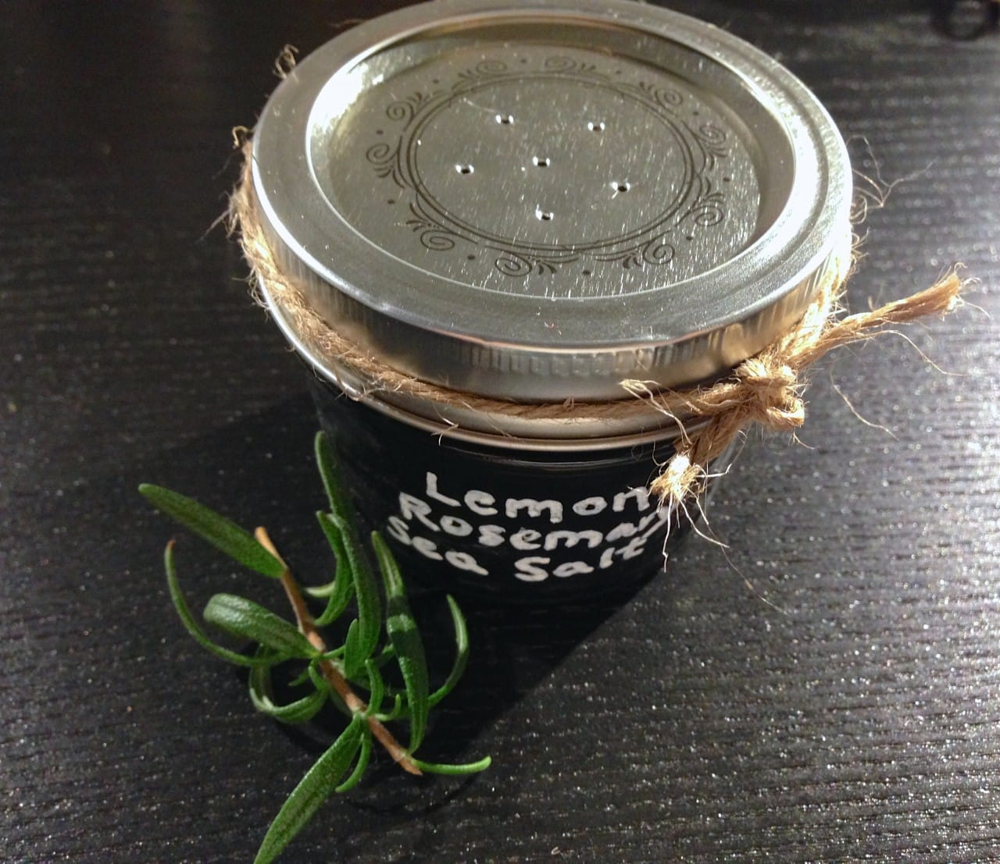

Time for the sea salt recipe! A fun idea to incorporate this favor further in to the wedding theme is to make it more of an interactive piece of décor. Place one in front of each person’s place setting with a sign on each table that unsalted french fries or chips (or something just as fun!) would be served and to feel free to test out their new shaker on the food!

Ingredients for one:
<ul><li>
1/2 teaspoon of lemon zest (approx 1/5th of the outside of a medium lemon)
</li><li>
1/2 teaspoon of fresh rosemary (shown in photo)
</li><li>
4 Tablespoons of course sea salt
</li></ul>
Instructions:

          
        

          
        

<ul><li>
Add all ingredients to food processor with metal blades.
</li><li>
Grind on “fine” for 20-30 seconds or until rosemary and lemon are ground up evenly with the salt.
</li><li>
Keep in an airtight container for up to two months.
</li><li>
Recipe makes enough to completely fill one 4-ounce Mason jar.
</li></ul><figure id="attachment_3542" aria-describedby="caption-attachment-3542" class="post__figure"><figcaption id="caption-attachment-3542">
All ground up!
</figcaption></figure>

Which of these three do-it-yourself Mason jar projects do you like best? If you make any for your own wedding (or another occasion), share your photos in the comments!

