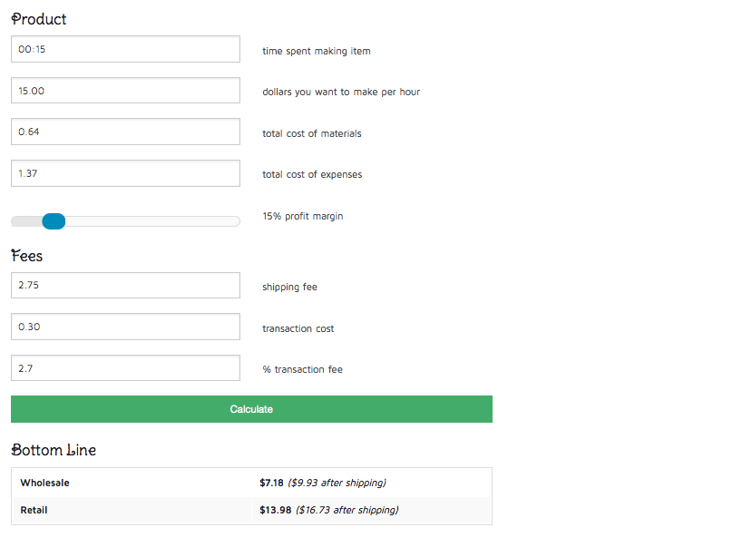

Tax season is finally over, yet even when it’s come and gone it always leaves a little something behind. Sometimes it’s a little extra cash in our pockets (yay!) Sometimes it’s a huge bill for taxes still due (boo!) Sometimes, it’s a spreadsheet of your expenses and earnings over the last year and a very clear picture of just how much you lost. This was my realization last month. I knew I had to make some big changes or I’d have to close my Etsy shop entirely!

Etsy is a wonderful place to explore selling your handmade items. You are inspired by something you see in a store, and think “Hey- I should try to make something like that!” You spend hours researching the supplies you will need, finding the best deals for them, ordering them. Then it’s time to create the product. You use up materials trying many different ways until you perfect it. You break out your camera and take tons of photos, and spend the entirety of your evening editing the photos to really showcase your item. Now it’s time to put up your Etsy listing so the whole world can see how talented you are at your craft. You fill out your ‘new listing’ form and stop at the end: “Price.” What on Earth do you charge for this? You need to charge more than what the materials cost you, or else you are losing money. You don’t want all that time you poured in to it to be wasted either. There are also fees on Etsy and Paypal to consider. It can get pretty confusing.

I had a very simple technique for figuring out how to price my items in the past: I looked up items similar to what I was selling, and priced them on the lower end of the spectrum for the similar item. I thought that was good enough, but after looking over my revenue vs expenses this past tax season, I realized I was sorely mistaken. On JUST the cost of materials alone (not the time to research, buy, make and photography the items), I was in the negative by HUNDREDS of dollars. Basically, *I* was
<em>
paying
</em>
my customers to *take* my items. I didn’t make any profit; I didn’t break even; I didn’t even just lose money- I lost a LOT of money. I knew I had to change things in a big way.

I searched forum after forum; blog after blog. I read some really great advic
<em>
e: Do Not Undervalue Your Work! By pricing your items SUPER low, it pretty much ruins it for all the artisans out there who are making the same type of item but are pricing it correctly. Don’t be that guy.
</em>
All the advice was great, and I was finally caving in to the idea of pricing my items at what they should
<em>
actually
</em>
cost vs what I
<em>
assumed
</em>
they should cost based on other sellers. Still, I didn’t know what this meant or how to go about it.

The closest I came was finding a formula on an Etsy blog titled, “
<a title="A Simple Formula For Pricing Your Work" href="https://blog.etsy.com/en/2012/a-simple-formula-for-pricing-your-work/" target="_blank" rel="noopener noreferrer">A Simple Formula For Pricing Your Work</a>
“:

Materials + Labor + Expenses + Profit = Wholesale x 2 = Retail

I thought this was amazing. It was by no means magic- I still needed to do a ton of calculations and figure out things like “what I want to pay myself for my time” and “what on Earth should my profit % be?” but for these I just did research. I figured that I’d like to make at least $15 an hour, and that 15% profit is a good start. I started writing the formula down, adding up my supplies down to the penny, plugging in everything and jotting it all down. But what about fees? It costs money to list something on Etsy, and if it sells, both Etsy AND Paypal (if that’s how it was purchased) take a cut. I wanted to figure out these costs too and add them in, because I can’t afford to be paying out of pocket for them. At the end of the day (okay, really, at the end of the week- it took me a long time to figure this all out!), I came up with a new formula:

Labor + Materials + Expenses = SUM 1

SUM 1 x Profit = SUM 2

SUM 2 + SUM1 = Wholesale ( x 2) = Retail

<em>Then I had to figure in fees. I used the first Paypal option because that is what most people in my shop pay with. Fees are figured out with shipping already included, so I had to add that in for this part.</em>
<em> </em>
Retail + Shipping = SUM3

Paypal Transaction Fee of .30 cents + 2.7% of total money collected (item + shipping, aka SUM3)

<em>OR</em>

Direct Checkout Fee of Etsy of .25 per transaction + 3% of total money collected (item + shipping, aka SUM3)

So,

Transaction Fee + % fee of total monies collect = SUM4

SUM3 + SUM 4 (-Shipping) = New Retail Cost!

Holy moly. It was clumsy, but it worked. But oh goodness did it take a long time to write all that down for each item. My head was spinning. That’s when the Husband stepped in, and wrote me a wonderful tool to take away some of the headache! He called it simply the
<strong>
“Etsy Pricer,”
</strong>
since that’s what it does. You plug in how much you want to make an hour, the number of minutes it took to make, the amount of money you spent on supplies. There’s a sliding scale for the profit margin and you don’t need to figure out the Paypal/Direct Checkout percentages yourself. At the end, you have a bottom line including both a retail price
<em>
and
</em>
a wholesale price, so you can use whichever you plan on.

<em>I’m currently selling the above covered button earrings for $10.00. I *was* selling them for $6.50. Other Etsy sellers are selling similar ones for as low as $5. According to the formula, I *should* be selling them for a MINIMUM of $13.98 per pair!</em>

You can imagine my surprise to find out that many of my items should have been priced at double or even TRIPLE what I was currently charging. Still, I feel bad charging that much more! I also hadn’t even entered in the amount of time it took to research, buy supplies, take photos and make a listing- I ONLY included the time it took to physically make the item. If I’d put all the time it took for each item, my prices would have been even higher! I needed to charge enough to make money on each item- that’s what I’m doing on Etsy after all- selling my products! I compromised on the items that were much much higher in price, and priced them out somewhere between the wholesale and retail prices. At least I’d make a few bucks on them, then. Hopefully in the future I can do well enough that I don’t need to short change myself at all! Til every seller on Etsy properly prices out their items though, this won’t likely happen. At least I can say I’m no longer part of the problem!

Let’s use the above covered button earrings as an example on my new pricing:

:::Breakdown:::

<em>Labor:</em>
<em><strong>
15 minutes
</strong>
to make product
</em>
<em>Dollars I want to make per hour:</em>
<em><strong>
$15.00
</strong></em>
<em>Materials: Earring bases &#x26; backs = .08 per earring, (.17 per pair); Button Covers, size 20 1/2” = .16 each, (.32 per pair); Fabric for covered buttons = .05 per pair; E6000 Glue = bottle is $7; use = .10 per pair —</em>
<em><strong>
$0.64 total
</strong></em>
<em>Expenses: Etsy listing fee = .20; Earring box = .26; Business card = .10; Printed receipt &#x26; label = .10; 4×8 Bubble Wrap Mailer = .16 (I KNOW! I CAN’T BELIEVE I FOUND THEM FOR SO CHEAP! THANK YOU</em>
<em><a title="25 4X8 BUBBLE MAILERS ON AMAZON" href="http://amzn.to/Qz1KQy" target="_blank" rel="noopener noreferrer"><strong>
AMAZON
</strong></a>
!); Twine, tape, sticker, freebie = .45; Tissue paper/bubble wrap = .10 —
<strong>
$1.37 total
</strong></em>
<em>Profit:</em>
<em><strong>
15%
</strong></em>
<em>Shipping Fee:</em>
<em><strong>
$2.75*
</strong></em><blockquote>
<em>*I have a lot of different shipping options, but with this as the standard, it’s what I used in my formulas. If someone chooses a more expensive shipping option, I may lose a few cents on the transaction fees later, but that’s fine by me.</em>
</blockquote>
<em>Transaction Cost: (I used Paypal for this example)</em>
<em><strong>
$0.30
</strong></em>
<em>Transaction % Fee:</em>
<em><strong>
2.7%
</strong></em>
<em><strong>Bottom Line:</strong></em>
<strong><em>
Wholesale: $7.18; Retail: $13.98
</em></strong>
It is sooooooo much easier to use this tool than to hand write it all out myself! I’m grateful to my Husband for making it for me, and excited to share it with you guys! Ready to see how much you SHOULD be charging for your products? Fill out all the info below (be sure to enter your info in the fields
<em>
exactly
</em>
as the example in each field is shown!) Make sure you bookmark this page for all your future
<strong>
Etsy Pricer
</strong>
needs! Comment if you use this and find it useful, and let me know if you have any questions!

